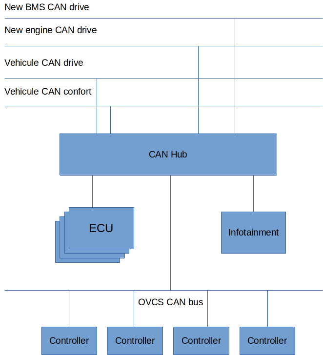

# Open Vehicle Control System (OVCS)

An open-source hardware and software platform for vehicle embedded systems, built with [Elixir](https://elixir-lang.org/), [Nerves](https://nerves-project.org/), [Phoenix](https://www.phoenixframework.org/), and [Flutter](https://flutter.dev/).

OVCS tackles vendor parts lock-in in transportation by redesigning the embedded systems in a vehicle. It allows parts from different brands to seamlessly communicate and creates an abstraction layer on top of them that can be standardized, extended, and monitored.

## About

OVCS was started in early 2024 by [Marc Lainez](https://github.com/mlainez), Loic Vigneron, and Thibault Poncelet at [Spin42](https://www.spin42.com/). The project was born from a desire to make vehicle embedded computing accessible using simple, off-the-shelf components and high-level programming languages.

The first full-size platform, **OVCS1**, is a 2007 Volkswagen Polo converted to an electric vehicle using a Nissan Leaf AZE0 drivetrain, a Bosch iBooster Gen2 brake system, an Orion BMS2 battery management system, and custom Arduino-based controllers -- all orchestrated by Elixir running on Raspberry Pis via the Nerves framework.

A smaller-scale platform, **OVCS Mini**, replicates the same software and hardware stack on a Traxxas 4WD RC car, enabling safe development and testing of remote control and ROS2 features before deploying to the full-size vehicle.

## Key Features

- **CAN bus abstraction** -- The [Cantastic](./libraries/cantastic) library provides a YAML-driven CAN bus communication layer that handles frame encoding/decoding, signal extraction, and multi-bus routing via Linux SocketCAN.
- **Multi-vendor component integration** -- Seamlessly makes parts from Nissan, Volkswagen, Bosch, Orion, and custom OVCS components work together by isolating and bridging their CAN buses.
- **Vehicle Management System (VMS)** -- The central brain of the vehicle, running on a Raspberry Pi 4, that translates and orchestrates all vehicle components.
- **Infotainment system** -- An in-car touchscreen UI built with Flutter running on a Raspberry Pi 5, providing gear selection, vehicle status, and diagnostics.
- **Remote control** -- Drive the vehicle using a MAVLink-compatible RC transmitter via a dedicated bridge on a Raspberry Pi 3A.
- **ROS2 integration** -- A bridge for Robot Operating System 2 communication, enabling autonomous driving research with IMU data publishing and joystick interpretation.
- **Generic controllers** -- Arduino R4 Minima-based controllers that interface with specific vehicle components via CAN bus, receiving their configuration from the VMS through an over-the-air adoption process.
- **OBD2 diagnostics** -- A diagnostic mode for reading standard OBD2 data from any vehicle.
- **Debug dashboard** -- A real-time Vue.js web dashboard for monitoring vehicle metrics, CAN bus traffic, and component status during development.

## Architecture Overview

OVCS is designed around multiple isolated CAN buses to prevent message conflicts between components from different manufacturers. The VMS acts as the central hub, connected to all buses.

```
                          +---------------------+
                          |    Infotainment      |
                          |    (RPi 5 + Flutter) |
                          +---------+-----------+
                                    |
                                OVCS CAN Bus
                                    |
+------------------+    +-----------+-----------+    +------------------+
| Radio Control    |    |                       |    | ROS Bridge       |
| Bridge (RPi 3A) +----+    VMS (RPi 4)        +----+ (RPi 4/5)       |
+------------------+    |    Central Brain       |    +------------------+
                        +-+---+---+---+---+---+-+
                          |   |   |   |   |   |
                    +-----+   |   |   |   |   +------+
                    |         |   |   |   |           |
               Leaf CAN  Polo CAN | BMS CAN    Misc CAN
                              |
                          OVCS CAN
                              |
                   +----------+----------+
                   |          |          |
              Controller  Controller  Controller
              (Arduino)   (Arduino)   (Arduino)
```

See the [hardware architecture documentation](./docs/hardware_architecture.md) for more details.



## Repository Structure

This is a monorepo containing multiple independent applications:

```
ovcs/
+-- vms/                        Vehicle Management System
|   +-- core/                     Elixir library - VMS platform + component drivers (no vehicle code)
|   +-- api/                      Phoenix JSON API + WebSocket server for the debug dashboard
|   +-- dashboard/                Vue.js real-time debug dashboard (Vite + ECharts + TailwindCSS)
|   +-- firmware/                 Nerves firmware targeting Raspberry Pi 4
|
+-- infotainment/               Infotainment System
|   +-- core/                     Elixir library - infotainment platform (no vehicle code)
|   +-- api/                      Phoenix JSON API + WebSocket server for the Flutter dashboard
|   +-- dashboard/                Flutter/Dart in-car touchscreen application
|   +-- firmware/                 Nerves firmware targeting Raspberry Pi 5
|
+-- vehicles/                   Vehicle Packages (pluggable)
|   +-- ovcs1/                    Full-size Polo EV conversion
|   +-- ovcs_mini/                Traxxas RC car platform
|   +-- obd2/                     OBD-II diagnostic mode
|   Each bundles its VMS + infotainment composers and CAN topology.
|
+-- bridges/                    Communication Bridges
|   +-- radio_control_bridge/     MAVLink RC transmitter bridge (Nerves on RPi 3A)
|   +-- ros_bridge/               ROS2/Zenoh bridge with IMU support (Nerves on RPi 4/5)
|
+-- controllers/                Arduino Controllers
|   +-- generic_controller/       PlatformIO C++ project for Arduino R4 Minima
|
+-- libraries/                  Shared Libraries
|   +-- cantastic/                CAN bus communication library (Elixir, SocketCAN)
|   +-- ovcs_can/                 Shared CAN component frame/signal YAMLs
|   +-- ovcs_vehicle/             OvcsVehicle top-level behaviour + scaffold
|   +-- ovcs_bus/                 Node-local pub/sub + optional MQTT relay/broker
|   +-- ovcs_bridge/              Behaviour + supervisor for bridge libraries
|   +-- ovcs_control/             PID controller + input filters
|   +-- express_lrs/              MAVLink v2 telemetry reader (ExpressLRS)
|   +-- msp_osd/                  MSP / DisplayPort OSD stack for MSP-compatible VTXs
|
+-- scripts/                    Utility Scripts
|   +-- setup_can.sh              Physical CAN setup on hardware (manual fallback)
|   +-- bind_remote_can.rb        Mirror a remote Nerves device's CAN bus over socketcand
|   +-- faker.rb                  Generate fake OVCS1 CAN frames for dev
|   +-- sleep_loop.rb             Toggle ignition frames in a loop for testing
|
+-- config/                     Global Configuration
|   +-- bms_config.o2bms          Orion BMS2 configuration
|
+-- candumps/                   CAN bus capture logs for offline testing and replay
+-- docs/                       Project documentation
+-- ovcs                        CLI tool for building, burning, and uploading firmware
```

## Supported Vehicles

| Vehicle | Description | Status |
|---------|-------------|--------|
| **OVCS1** | 2007 VW Polo converted to EV with Nissan Leaf AZE0 motor, Bosch iBooster Gen2, Orion BMS2, VW Polo 9N original systems | Drivable (manual + remote) |
| **OVCS Mini** | Traxxas 4WD RC car with the same OVCS software/hardware stack for development and testing | Operational |
| **OBD2** | Diagnostic mode for reading OBD2 data from any vehicle via a standard OBD plug | Operational |

## Technology Stack

| Layer | Technology |
|-------|------------|
| Vehicle control logic | Elixir |
| Embedded firmware | [Nerves](https://nerves-project.org/) (Linux + Erlang/OTP on Raspberry Pi) |
| Web APIs | [Phoenix Framework](https://www.phoenixframework.org/) 1.7 |
| In-car UI | [Flutter](https://flutter.dev/) / Dart |
| Debug dashboard | [Vue.js](https://vuejs.org/) 3 + [Vite](https://vitejs.dev/) + [ECharts](https://echarts.apache.org/) |
| CAN bus communication | [Cantastic](./libraries/cantastic) (Elixir + Linux SocketCAN) |
| Controllers | C++ / [PlatformIO](https://platformio.org/) on Arduino R4 Minima |
| Database | SQLite via [Ecto](https://hexdocs.pm/ecto/Ecto.html) |
| Real-time communication | Phoenix Channels (WebSocket) |
| ROS2 integration | [Zenoh](https://zenoh.io/) + MQTT |

## Quick Start

See the [Getting Started guide](./docs/getting_started.md) for full prerequisites and setup (Linux / VM, mise, system packages, fwup, bootstrap, verification).

Once the setup is done:

```sh
# Provision vcan interfaces and boot the whole vehicle in one BEAM
./ovcs run ovcs1                         # VMS + infotainment + bridges

# Start the VMS debug dashboard (in another terminal)
cd vms/dashboard && npm install && npm run dev
```

`ovcs run` starts each vehicle package as its own Mix app (VMS core
+ Phoenix API on :4000, infotainment core + Phoenix API on :4001 when
present, plus any host-compatible bridges from `bridge_firmwares/0`).
See [Applications](./docs/applications.md) for more details and the
per-side breakdown if you prefer running pieces separately.

## Deploy

Build, burn, or OTA-upload firmware via the `ovcs` CLI:

```sh
./ovcs vehicles                          # list discovered vehicles and their Nerves targets
./ovcs build  ovcs1 vms                  # also: infotainment | <bridge-firmware-id>
./ovcs burn   ovcs1 vms
./ovcs upload ovcs1 vms [--host HOST] [--file FILE]
```

## Presentations and Media

| Event | Date | Links |
|-------|------|-------|
| ElixirConf EU 2024 | April 2024 | [Video: Retrofitting a Car and Running it with Elixir](https://www.youtube.com/watch?v=2rL5yIEUU84) -- [Slides](https://github.com/open-vehicle-control-system/presentations/tree/main/ElixirconfEU%20%2019-04-2024) |
| Makilab | November 2024 | [Slides](https://github.com/open-vehicle-control-system/presentations/tree/main/Makilab%204-11-2024) |
| FOSDEM 2025 | February 2025 | [Video: Converting an '07 car to an RC EV using open source software](https://www.youtube.com/watch?v=b74WbEGoPgI) -- [Video: Building a robot from a Traxxas RC car](https://www.youtube.com/watch?v=KSj2oYt7g1E) -- [Slides](https://github.com/open-vehicle-control-system/presentations/tree/main/Fosdem%202-2-2025) |
| OVCS Teaser | 2025 | [Video: Open Vehicle Control System teaser](https://www.youtube.com/watch?v=429IfI6uzBg) |

Subscribe to the [Spin42 Engineering YouTube channel](https://www.youtube.com/@spin42engineering) for video updates, demos, and build logs.

## Documentation

Full documentation is available in the [`docs/`](./docs/README.md) directory:

1. [Getting Started](./docs/getting_started.md) -- Environment setup and installation
2. [Applications](./docs/applications.md) -- Application descriptions and local development
3. [Hardware Architecture](./docs/hardware_architecture.md) -- Hardware design and component overview
4. [Running on Hardware](./docs/running_hardware.md) -- Firmware deployment and configuration
5. [Testing CAN Messages](./docs/testing_can_messages.md) -- Simulating CAN traffic for development
6. [Testing Generic Controllers](./docs/testing_generic_controllers.md) -- Controller adoption and I/O testing

## Disclaimer

OVCS is provided as-is without any warranty. Use it at your own risk. It is not road-certified and therefore does not meet all required criteria to be so. We decline any responsibility for any incident resulting from the usage of OVCS. OVCS is a hobby research project.

## License

[MIT License](./LICENCE.txt) -- Copyright (c) 2026 Spin42 SRL
