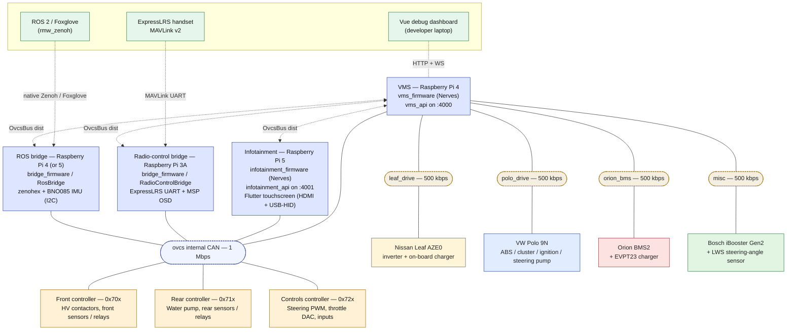

# OVCS Hardware Architecture

## Design Principles

OVCS hardware is designed around two core principles:

1. **CAN bus isolation** — components from different manufacturers may use conflicting CAN message IDs, so OVCS keeps each manufacturer's bus separate and bridges them through the VMS.
2. **Off-the-shelf components** — Raspberry Pi and Arduino boards keep the development kit affordable and accessible.

## Hardware Components

### Computing Devices

| Device | Role | CAN Connectivity |
|--------|------|------------------|
| **Raspberry Pi 4** | Vehicle Management System (VMS) | Connected to all CAN buses via custom SPI CAN hub |
| **Raspberry Pi 5** | Infotainment system | Connected to the OVCS CAN bus |
| **Raspberry Pi 3A** | Radio control bridge | Connected to the OVCS CAN bus |
| **Raspberry Pi 4/5** | ROS2 bridge | Connected to the OVCS CAN bus |
| **Arduino R4 Minima** (x3 for OVCS1) | Generic controllers (front, rear, controls) | Connected to the OVCS CAN bus |

### CAN Bus Interface Hardware

- **Custom Raspberry Pi CAN bus HATs** -- SPI-to-CAN interface boards for connecting the Raspberry Pi to CAN networks.
- **Custom multi-CAN SPI board** -- A hub board that provides the VMS access to multiple CAN buses over a single SPI interface, enabling the VMS to communicate with all isolated bus segments.

### Vehicle-Specific Components (OVCS1)

| Component | Manufacturer | Purpose |
|-----------|-------------|---------|
| Leaf AZE0 Inverter + Motor | Nissan | Electric drivetrain (motor control, regenerative braking) |
| NV200 Battery Cells | Nissan | High-voltage battery pack (custom aluminum enclosures) |
| iBooster Gen2 | Bosch | Electronic brake booster (replaces vacuum-assisted brakes) |
| LWS Steering Angle Sensor | Bosch | Steering position feedback |
| BMS2 | Orion | Battery management system (cell monitoring, balancing, protection) |
| EVPT23 | EVPT | On-board charger |
| Polo 9N Systems | Volkswagen | ABS, dashboard/cluster, ignition lock, power steering pump |

## High-Level Architecture (OVCS1)

The VMS sits at the centre of the topology. Every vehicle CAN bus terminates on the VMS Pi 4 via its multi-CAN SPI hub — manufacturer components on different buses never see each other's traffic, so message-ID collisions can't happen. The internal `ovcs` bus carries OVCS-only traffic (heartbeats, controller adoption, bridge ↔ VMS commands).


```mermaid
flowchart TB
    classDef pi       fill:#dde5ff,stroke:#3344aa,color:#111
    classDef arduino  fill:#fff1d6,stroke:#a07000,color:#111
    classDef internal fill:#f0f4ff,stroke:#3344aa,color:#222,stroke-dasharray:4 2
    classDef vbus     fill:#f5efe2,stroke:#a07000,color:#222,stroke-dasharray:4 2
    classDef leaf     fill:#fef4d8,stroke:#666,color:#222
    classDef polo     fill:#e1ecff,stroke:#2244aa,color:#222
    classDef orion    fill:#fde2e2,stroke:#a83232,color:#222
    classDef bosch    fill:#e2f5e2,stroke:#2a7a3a,color:#222
    classDef external fill:#e7f6ec,stroke:#2a7a3a,color:#111

    subgraph EXT[" "]
        direction LR
        RADIO["ExpressLRS handset<br/>MAVLink v2"]:::external
        ROS["ROS 2 / Foxglove<br/>(rmw_zenoh)"]:::external
        DASH["Vue debug dashboard<br/>(developer laptop)"]:::external
    end

    VMS["VMS — Raspberry Pi 4<br/>vms_firmware (Nerves)<br/>vms_api on :4000"]:::pi
    INFO["Infotainment — Raspberry Pi 5<br/>infotainment_firmware (Nerves)<br/>infotainment_api on :4001<br/>Flutter touchscreen (HDMI + USB-HID)"]:::pi
    RCB["Radio-control bridge — Raspberry Pi 3A<br/>bridge_firmware / RadioControlBridge<br/>ExpressLRS UART + MSP OSD"]:::pi
    ROSB["ROS bridge — Raspberry Pi 4 (or 5)<br/>bridge_firmware / RosBridge<br/>zenohex + BNO085 IMU (I2C)"]:::pi

    OVCS_BUS(["ovcs internal CAN — 1 Mbps"]):::internal
    LEAF_BUS(["leaf_drive — 500 kbps"]):::vbus
    POLO_BUS(["polo_drive — 500 kbps"]):::vbus
    ORION_BUS(["orion_bms — 500 kbps"]):::vbus
    MISC_BUS(["misc — 500 kbps"]):::vbus

    FRONT["Front controller — 0x70x<br/>HV contactors, front sensors / relays"]:::arduino
    REAR["Rear controller — 0x71x<br/>Water pump, rear sensors / relays"]:::arduino
    CTRLS["Controls controller — 0x72x<br/>Steering PWM, throttle DAC, inputs"]:::arduino

    LEAF["Nissan Leaf AZE0<br/>inverter + on-board charger"]:::leaf
    POLO["VW Polo 9N<br/>ABS / cluster / ignition / steering pump"]:::polo
    ORION["Orion BMS2<br/>+ EVPT23 charger"]:::orion
    BOSCH["Bosch iBooster Gen2<br/>+ LWS steering-angle sensor"]:::bosch

    %% OVCS internal bus
    VMS  --- OVCS_BUS
    INFO --- OVCS_BUS
    RCB  --- OVCS_BUS
    ROSB --- OVCS_BUS
    OVCS_BUS --- FRONT
    OVCS_BUS --- REAR
    OVCS_BUS --- CTRLS

    %% Per-manufacturer buses, VMS-only access
    VMS --- LEAF_BUS  --- LEAF
    VMS --- POLO_BUS  --- POLO
    VMS --- ORION_BUS --- ORION
    VMS --- MISC_BUS  --- BOSCH

    %% External transports
    RADIO -. MAVLink UART .-> RCB
    ROS   -. native Zenoh / Foxglove .-> ROSB
    DASH  -. HTTP + WS .- VMS

    %% Erlang distribution between BEAMs
    VMS  <-. OvcsBus dist .-> INFO
    VMS  <-. OvcsBus dist .-> RCB
    VMS  <-. OvcsBus dist .-> ROSB
```

### How the SPI-CAN hub is wired

The VMS Pi 4 has a single SPI peripheral. The custom multi-CAN hub board fans it out to five MCP2517FD CAN controllers — one per bus shown above — each with its own transceiver. Cantastic addresses them as `spi0.0` … `spi0.4`. The OVCS internal bus runs at 1 Mbps because OVCS-internal traffic (controller adoption, heartbeats, infotainment ↔ VMS, bridges ↔ VMS) is dense; the four manufacturer buses run at the stock 500 kbps their components require.

### Why every bridge SoC is its own Pi

Each bridge runs on a dedicated Pi rather than sharing one with the VMS because:

- **Failure isolation.** A misbehaving radio link or ROS publisher can hang its own BEAM without dragging the VMS supervision tree down.
- **Cabling.** RC receivers live near the antenna, the ROS bridge typically rides on the autonomy stack — both are physically distant from the VMS bay.
- **Targets.** The Pi 3A is cheap and adequate for the RC bridge; ROS needs the Pi 4/5's RAM.

The BEAMs still join one Erlang-distribution cluster via `OvcsBus.Cluster`, so the application-level pub/sub is unified — they talk over the vehicle LAN as if they were threads in the same VM.


> The PNG above is a hand-drawn rendering kept for marketing decks. The Mermaid diagram is the source of truth.

## CAN Bus Network Topology

OVCS1 uses five isolated CAN bus segments:

| Network | Bitrate | Purpose | Connected Components |
|---------|---------|---------|---------------------|
| `ovcs` | 1 Mbps | Internal OVCS communication | VMS, Infotainment, Controllers, Radio Control Bridge, ROS Bridge |
| `leaf_drive` | 500 kbps | Nissan Leaf drivetrain | Leaf Inverter, Leaf Charger |
| `polo_drive` | 500 kbps | Original VW Polo systems | ABS, Dashboard, Ignition Lock, Airbag |
| `orion_bms` | 500 kbps | Battery management | Orion BMS2, EVPT23 Charger |
| `misc` | 500 kbps | Additional components | Bosch iBooster, Bosch LWS Steering Sensor |

The OVCS CAN bus runs at 1 Mbps to accommodate the higher traffic volume from all OVCS-internal components (controllers, bridges, infotainment). External buses run at the standard 500 kbps required by their respective components.

### CAN Bus Configuration

Shared component-level CAN frame and signal specifications live in the [`libraries/ovcs_can`](../libraries/ovcs_can) library. Each vehicle bundles its own topology YAMLs (VMS and infotainment) inside its package under `vehicles/<name>/priv/can/`.

```
libraries/ovcs_can/priv/can/components/
+-- bosch/i_booster_gen2/            # iBooster frame definitions
+-- bosch/lws/                       # Steering angle sensor frames
+-- evpt/evpt23/                     # Charger frames
+-- nissan/leaf_aze0/                # Leaf inverter and charger frames
+-- orion/bms2/                      # Battery management frames
+-- ovcs/                            # OVCS internal frames and generic controller templates
+-- volkswagen/polo_9n/              # Polo ABS, dashboard, key, lock, wheels frames
+-- obd2/                            # OBD2 diagnostic frames

vehicles/<name>/priv/can/
+-- vms.yml                          # full CAN topology read by vms_core
+-- infotainment.yml                 # narrow CAN topology read by infotainment_core (optional)
+-- generic_controller/              # per-vehicle controller frame wirings
```

The two topology YAMLs differ per side (VMS needs every frame; infotainment only subscribes to what the dashboard renders). Both import shared component specs from the library via Cantastic's cross-app syntax:

```yaml
- import!:@ovcs_can:can/components/ovcs/0x1A0_vms_status.yml
```

## Generic Controllers

OVCS uses Arduino R4 Minima boards as generic, configurable I/O controllers. They are "generic" because a single firmware runs on all controllers -- the specific pin assignments and behavior are configured over the CAN bus via an **adoption process**.

### OVCS1 Controllers

| Controller | CAN ID Range | Purpose |
|-----------|-------------|---------|
| Front Controller (`0x70x`) | `0x701`-`0x704` | High-voltage contactors, front sensors and relays |
| Rear Controller (`0x71x`) | `0x711`-`0x714` | Water pump, rear sensors and relays |
| Controls Controller (`0x72x`) | `0x721`-`0x725` | Steering column PWM, throttle pedal DAC, control inputs |
| Test Controller (`0x73x`) | `0x731`-`0x738` | Development and testing (all pin types) |

### Adoption Process

1. A new (unconfigured) controller connects to the OVCS CAN bus and broadcasts its status as `ADOPTION_REQUIRED`.
2. The VMS initiates an adoption by sending a configuration frame (`0x700`) with pin assignments.
3. The operator presses the physical adoption button on the Arduino to confirm.
4. The controller stores its configuration in EEPROM and begins normal operation.
5. On subsequent boots, the controller loads its configuration from EEPROM and starts immediately.

### Supported Pin Types

| Pin Type | Description | CAN Frame |
|----------|-------------|-----------|
| Digital Output | On/off control (relays, contactors) | `0x7X2` (request) / `0x7X4` (status) |
| Analog Input | Sensor readings (0-16383 range, 14-bit) | `0x7X4` (status) |
| PWM Output | Variable duty cycle (0-4095, 12-bit) | `0x7X3` (request) |
| DAC Output | Analog voltage output (0-4095, 12-bit) | `0x7X3` (request) |
| External PWM | PWM via SPI expansion boards (16-bit duty, 24-bit freq) | `0x7X5`-`0x7X8` (request) |

## OVCS Mini Hardware

The OVCS Mini uses the same software stack on a Traxxas 4WD RC car chassis:

| Component | Hardware |
|-----------|----------|
| VMS | Raspberry Pi 4 |
| Controller | Arduino R4 Minima (single "main" controller) |
| Motor | Traxxas brushless motor (controlled via external PWM) |
| Steering | Traxxas servo (controlled via external PWM) |
| Radio Control | ExpressLRS receiver via Radio Control Bridge (RPi 3A) |

The OVCS Mini uses a single CAN bus (`ovcs` at 500 kbps) since there are no third-party automotive components requiring isolation.

Next: [Running on Hardware](./running_hardware.md)
