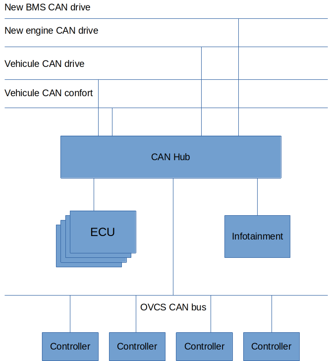

# OVCS Hardware

OVCS is based on several hardware components. Some needing high reliability and redundency.

In order to keep costs of making an OVCS development kit, we deliberately use off-the-shelve componenets and try to bind OVCS as little as possible to a specific platform.

The first iteration of OVCS has been built on the following hardware:

```
- Raspberry Pi4 8Go RAM
- Arduino R4 Minima
- Custom Raspberry Pi Canbus hats
- Custom built multi CAN spi board
```

## High level architecture

In order to easily be connected to any vehicule and any components, we need to account for multiple factors:

* Can messages coming on the same CAN bus from components of different manufacturers might conflict with each other, so we need to isolate them from each other
* The OVCS ECU is a critical piece of the system. In order to ensure the maximum possible reliability, we need to foreseen redundency for this component.
* A lot of components won't necessarily be connected to the vehicule CAN bus anymore, or newer components will be installed (for instance, a different throttling pedal), we therefore need to foresee some "controllers" for these.

With these constraints in mind, we designed OVCS to have the following components:

* The ECU: The main control unit. This is the central brain, connected to all CAN Buses.
* The Infotainment: The in-car unit to show relevant information on a screen as well as offer some control functions.
* The CAN Bus hub: All can buses are connected and accessible via an SPI interface by the ECU. We chose to create a seperate hub using the standard SPI interface instead of using multiple Raspberry Pi hats to allow for the ECU to use a different hardware platform than the Raspberry Pi.
* The controllers: These are single purpose components aimed at interfacing on the can bus. They allow to mon,itor and control a specific component in the car and interface with the relevant CAN bus.



Next: [Running on hardware](./running_hardware.md)
