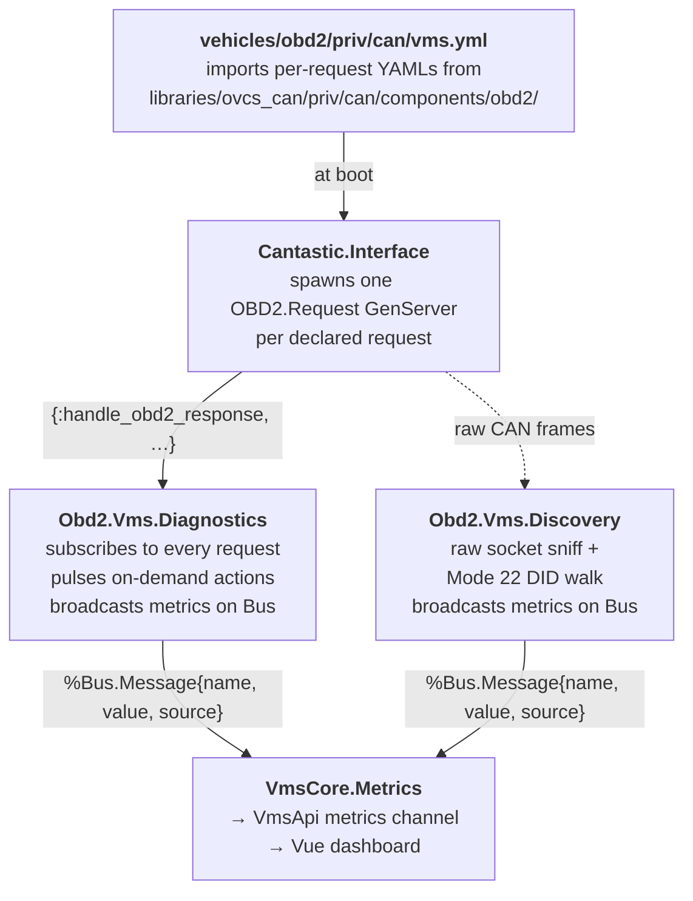

# OBD2 diagnostics

The `OBD2` vehicle profile turns the VMS into an OBD2 / KWP2000 / UDS
scan tool. It runs on the same VMS Raspberry Pi 4 as every other
vehicle profile, but with no drivetrain to control: every supervised
process exists to read or probe the diagnostic CAN bus.

## Why this is a vehicle profile

OVCS already speaks CAN through cantastic, has a Phoenix dashboard
with a metrics channel and supports per-vehicle composers. A scan
tool is just another composer that subscribes to OBD2 / UDS request
loops instead of e.g. Leaf inverter frames, and the existing dashboard
displays the results without any frontend change. Reusing the
infrastructure means:

* Adding or modifying a probe is a YAML edit + (optionally) a couple
  of Elixir lines, not a new app.
* The same dashboard people already use for OVCS1 debugging works on
  any car you plug into.
* Brand-specific knowledge stays in one composer — the rest of OVCS
  doesn't have to know.

## What you get out of the box

Five dashboard pages, all running off cantastic's standard codecs:

| Page | What it shows | Modes used |
|---|---|---|
| Dashboard | VIN, ECU name, headline live metrics, DTC counts, RPM/speed chart | 01, 03, 07, 0A, 09, 19 |
| Live data | Engine / temperature / electrical tables and line charts | 01 |
| DTCs | Stored / pending / permanent / UDS DTCs with Clear buttons | 03, 07, 0A, 19 + 04, 14 |
| Vehicle info | Mode 09 identification + UDS extended-session toggle | 09, 10, 3E |
| Discovery | Supported PIDs, UDS DID scan, passive bus traffic | 01 PID 0x00, 22, raw |

A DTC (Diagnostic Trouble Code) is the standardized 5-character code
the ECU sets when it detects a fault — the thing that turns on your
"check engine" light. The first character names the system: `P`
powertrain, `C` chassis, `B` body, `U` network. The four flavours the
dashboard reads have different meanings:

* **Stored (Mode 03)** — confirmed faults; the warning light is on
  because of these.
* **Pending (Mode 07)** — detected once but not yet confirmed.
* **Permanent (Mode 0A)** — emissions faults that survive Mode 04
  clearing on purpose; only a successful drive cycle removes them.
* **UDS (Mode 19)** — modern equivalent of Mode 03, with a status
  byte per code (confirmed / pending / test-failed-since-last-clear /
  …). Most post-2010 ECUs only answer Mode 19.

## Architecture



Two GenServers, one VMS Bus topic, the existing metrics pipeline.
Adding a new metric is mostly "subscribe to one more cantastic
request, broadcast its decoded value as a `%Bus.Message{}`" — the
dashboard composer then references it by `{module, key}` like every
other OVCS metric.

## Setup

### Prerequisites

* The VMS Raspberry Pi 4 with a Waveshare 2-CAN HAT (Pi-side configs
  in `vehicles/obd2/priv/firmware/vms/config.txt`).
* Cantastic checked out on the **`obd2` branch** under
  `libraries/cantastic/`. The OBD2 vehicle uses the Mode 09 / 19 / 22 /
  14 codecs that only exist on that branch:
  ```bash
  cd libraries/cantastic
  git fetch origin obd2
  git checkout obd2
  ```
* An OBDII cable wired so that:
  * pin 6 → CAN-High on the HAT's CAN0 channel
  * pin 14 → CAN-Low
  * pin 4 / 5 → ground
  * pin 16 → 12 V (only needed if the VMS draws power from the OBD2
    port; usually it doesn't).

### Build and flash

```bash
./ovcs build obd2 vms
./ovcs burn obd2 vms
```

Plug into the OBDII port, power up. The dashboard is at
`http://obd2-vms.local:4000/`.

## What's safe to do passively

Default polling is read-only. Pulling power, reading codes, asking
for the VIN — none of that changes ECU state. The dashboard's
**Clear** buttons (Mode 04 / Mode 14) and the UDS extended-session
toggle (Mode 10 / Mode 3E) are the only things that mutate the bus,
and they only fire when explicitly clicked.

The single realistic risk of leaving the scanner plugged in is
**12 V battery drain on a parked car**: continuous polling at ~10 Hz
keeps every ECU on the bus awake and prevents the usual "30 s of
quiet → sleep" transition. On any modern car, unplug between drives
or wire VMS power through ignition.

## Extending the scanner

The whole point of building this on cantastic is that adding a new
service is mostly a YAML change. Patterns below follow the same
brand-agnostic philosophy as cantastic's `obd2` branch: standardized
wire formats live in YAML, brand quirks live in your composer's
Elixir code.

### 1. Add a new live Mode 01 PID

Most generic additions look like this. Drop a parameter into one of
the existing live-data files
(`libraries/ovcs_can/priv/can/components/obd2/mode01_live_data_*.yml`):

```yaml
- name: barometric_pressure
  id: 0x33
  kind: integer
  value_length: 8
  unit: kPa
```

Cantastic will pack it into the existing batched Mode 01 request. The
diagnostic GenServer broadcasts every Mode 01 parameter automatically
as `%Bus.Message{name: :barometric_pressure, source: Diagnostics}`,
so the only Elixir change is referencing it from a dashboard page:

```elixir
%{type: :metric, name: "Barometric pressure",
  module: Diagnostics, key: :barometric_pressure, unit: "kPa"}
```

Pick a `frequency:` that matches how fast the value actually changes
— the `mode01_live_data_fast.yml` file is for things that move on
every driver input, `mode01_live_data_slow.yml` is for everything
else.

### 2. Add a brand-specific UDS DID (Mode 22)

Manufacturer-proprietary data lives behind 16-bit DIDs accessed via
Mode 22. Cantastic stays brand-agnostic by exposing the raw payload
as a `kind: "bytes"` parameter and letting your handler decode it.
Concrete example for a Nissan Leaf battery cell-voltage block:

```yaml
# priv/can/components/obd2/leaf_battery_cells.yml
name: leaf_battery_cells
request_frame_id: 0x79B
response_frame_id: 0x7BB
frequency: 1000
mode: 0x22
parameters:
  - name: cells
    id: 0x0002
    kind: bytes
    value_length: 1536          # 96 cells × 16 bits
```

Add a handler in a small dedicated module — keep brand code out of
`Diagnostics`:

```elixir
defmodule Obd2.Vms.Brands.NissanLeaf do
  use GenServer
  alias Cantastic.OBD2
  alias OvcsBus, as: Bus

  def start_link(_), do: GenServer.start_link(__MODULE__, nil, name: __MODULE__)

  @impl true
  def init(_) do
    OBD2.Request.subscribe(self(), :obd2, "leaf_battery_cells")
    OBD2.Request.enable(:obd2, "leaf_battery_cells")
    {:ok, %{}}
  end

  @impl true
  def handle_info({:handle_obd2_response,
                   %OBD2.Response{request_name: "leaf_battery_cells",
                                  parameters: %{"cells" => p}}},
                  state) do
    voltages = decode_cell_voltages(p.value)
    Bus.broadcast("messages", %Bus.Message{
      name: :leaf_cell_voltages, value: voltages, source: __MODULE__
    })
    {:noreply, state}
  end

  defp decode_cell_voltages(<<>>), do: []
  defp decode_cell_voltages(<<v::big-unsigned-integer-size(16), rest::bitstring>>) do
    [v / 1000 | decode_cell_voltages(rest)]
  end
end
```

Wire it into the OBD2 composer alongside `Diagnostics` and
`Discovery` so it boots with the vehicle:

```elixir
# vehicles/obd2/lib/obd2/vms/composer.ex
def children do
  [
    {Obd2.Vms, []},
    {Obd2.Vms.Diagnostics, []},
    {Obd2.Vms.Discovery, []},
    {Obd2.Vms.Brands.NissanLeaf, []}
  ]
end
```

The pattern is the same for every brand: declare the wire format in
YAML with `kind: "bytes"`, put the bit-twiddling in a brand-named
module, broadcast the result on `Bus`. The dashboard then shows it
through `%{module: NissanLeaf, key: :leaf_cell_voltages}` like any
other metric.

### 3. KWP2000 ECUs (older Toyota, Mitsubishi, some Hyundai)

Vintage Asian platforms answer Mode 0x21 (ReadDataByLocalIdentifier)
instead of Mode 01, and Mode 0x1A (ReadECUIdentification) instead of
Mode 09. Wire format mirrors Mode 01 but with 8-bit local
identifiers, so the YAML is shaped identically:

```yaml
name: toyota_engine_data
request_frame_id: 0x7E0
response_frame_id: 0x7E8
frequency: 200
mode: 0x21
parameters:
  - name: engine_load
    id: 0x05
    kind: integer
    value_length: 8
    unit: "%"
  - name: throttle_position
    id: 0x07
    kind: integer
    value_length: 8
    unit: "%"
```

`Diagnostics` doesn't decode Mode 0x21 by default (it would over-fit
to one platform), so add a handler the same way as for Mode 22 above.

### 4. UDS routines (Mode 31)

Forced DPF regen, ABS bleed, throttle adaptation reset, calibration
write — all live behind Mode 0x31 RoutineControl, which cantastic
treats as a fully manufacturer-specific service:

```yaml
name: vw_throttle_adapt_reset
request_frame_id: 0x7E0
response_frame_id: 0x7E8
frequency: 5000
mode: 0x31
options:
  routine_id: 0x0203
  sub_function: 0x01      # 0x01 startRoutine
```

Pulse on demand, the same way `Diagnostics.pulse/2` handles Mode 04
and Mode 14. Routines almost always need an extended session open
first — open it via the dashboard's Vehicle Info page, then trigger
the routine.

### 5. Discovery extension: brand-specific DID ranges

`OBD2.Discovery.start_did_scan/1` accepts a `:dids`, `:request_id`
and `:response_id` so you can probe non-standard ranges or different
ECUs without touching the GenServer. From an iex session on the
device:

```elixir
# Sweep VW long-coding bytes on the gateway ECU
Obd2.Vms.Discovery.start_did_scan(
  dids: Enum.to_list(0x0100..0x017F),
  request_id: 0x710,
  response_id: 0x77A
)
```

Adding a per-brand button to the dashboard is a `trigger_action/2`
clause that calls `start_did_scan/1` with the right pre-set range.

### 6. Reading the bus for proprietary chatter

The Discovery passive sniffer counts every frame ID it sees on the
OBD2 network and republishes a per-ID summary every second. That
list is the starting point for reverse-engineering vehicle-specific
broadcasts: spot a recurring ID that isn't standard OBD2 (i.e. not
0x7DF or 0x7E0–0x7EF), watch how its bytes change while you exercise
the car, and once you understand its shape, declare it as a regular
cantastic `received_frame:` in the OBD2 vehicle's YAML and add a
component module to decode it.

This is the same pattern OVCS already uses for the Leaf inverter,
EVPT charger and Polo body modules — the OBD2 vehicle profile just
gives you a terminal where you can do that work without a running
drivetrain.

## Negative responses

If an ECU rejects a request (`0x7F SID NRC`), the subscribing
GenServer receives `{:handle_obd2_error, {:nrc, sid, code, name}}`
instead of a response. `Diagnostics` logs these and keeps polling;
the request process never crashes. Common ones to expect:

| NRC | Name | What to do |
|---|---|---|
| 0x11 | service_not_supported | This ECU doesn't speak this mode at all (e.g. Mode 19 on a 2005 car); drop the request from YAML or accept the silence. |
| 0x12 | sub_function_not_supported | Try a different `sub_function:` in `options:`. |
| 0x22 | conditions_not_correct | Vehicle isn't in the state the ECU wants — engine off, ignition on, P or N, etc. |
| 0x33 | security_access_denied | Service requires Mode 0x27 security access (seed/key handshake). Cantastic doesn't ship this yet; do it manually via `Cantastic.Socket` until it lands. |
| 0x7E | sub_function_not_supported_in_active_session | Open the extended session first (Mode 10 0x03). |

## Where things live

| What | Where |
|---|---|
| Standard OBD2 / UDS request YAMLs | `libraries/ovcs_can/priv/can/components/obd2/` |
| Vehicle import file | `vehicles/obd2/priv/can/vms.yml` |
| Diagnostic orchestrator | `vehicles/obd2/lib/obd2/vms/diagnostics.ex` |
| PID name catalog | `vehicles/obd2/lib/obd2/vms/pid_catalog.ex` |
| Discovery (passive + DID probe) | `vehicles/obd2/lib/obd2/vms/discovery.ex` |
| Composer + dashboard pages | `vehicles/obd2/lib/obd2/vms/composer/` |
| Multi-line metric rendering | `vms/dashboard/src/components/tables/RealTimeTable.vue` |

The cantastic-side reference for every supported service, including
the YAML knobs and the negative-response table, is in
[`Cantastic.OBD2`](https://hexdocs.pm/cantastic/Cantastic.OBD2.html)
on the `obd2` branch.
