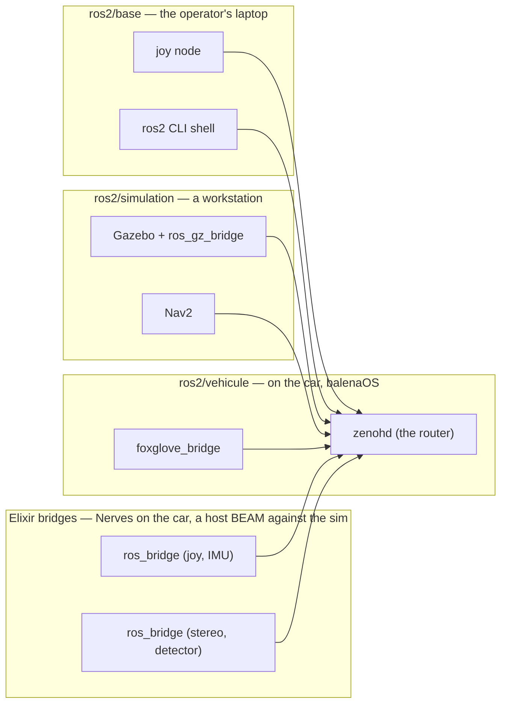
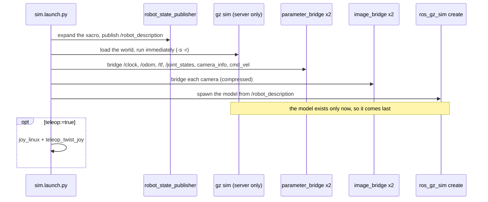
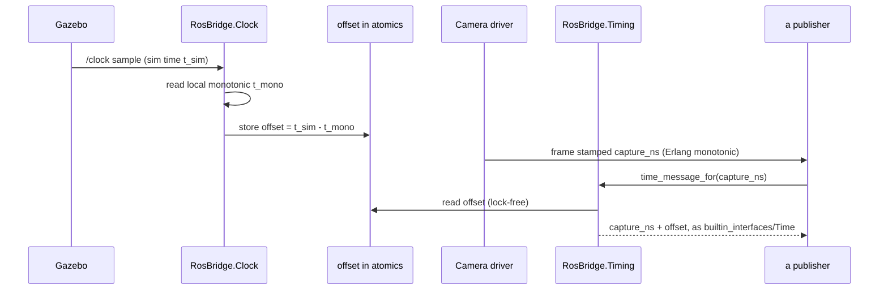
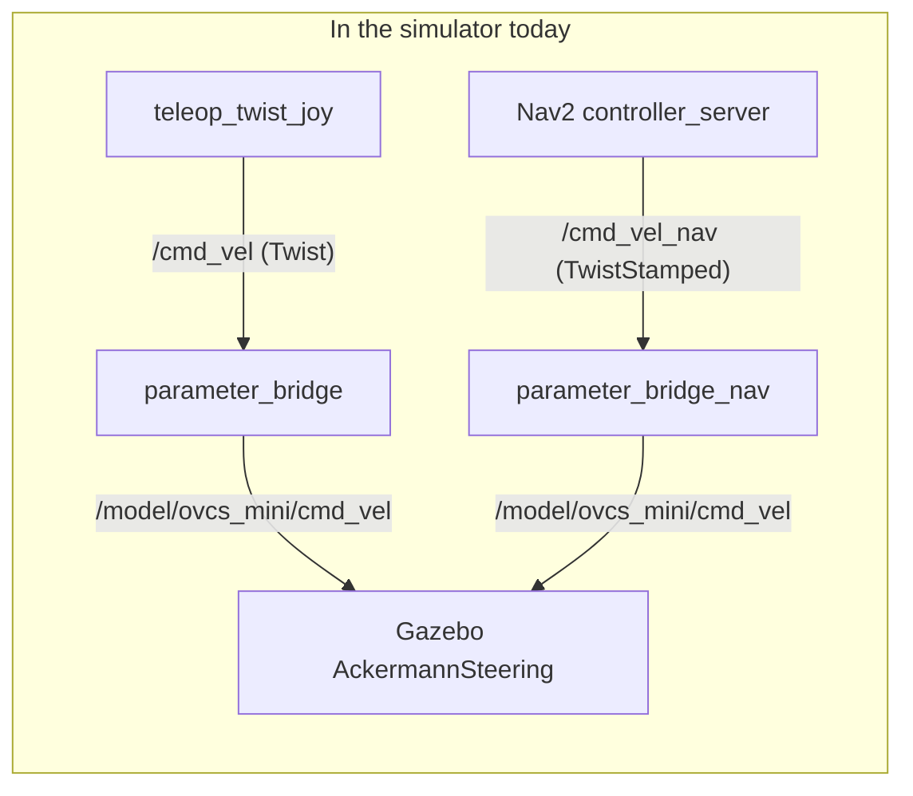
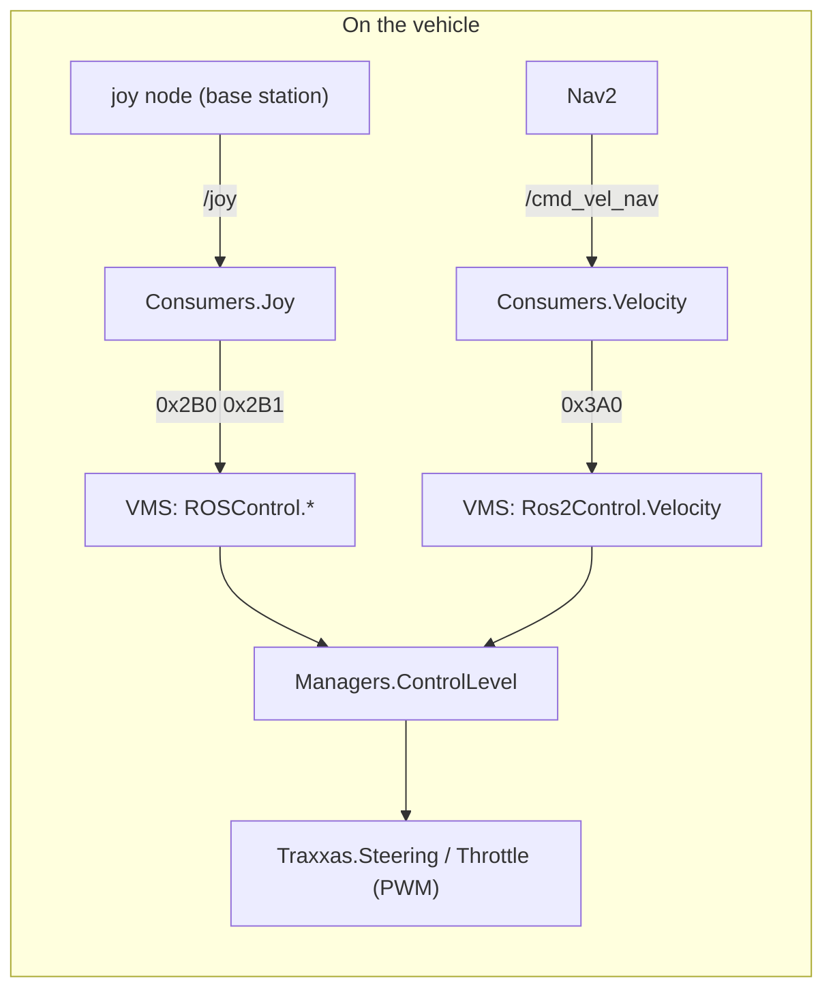
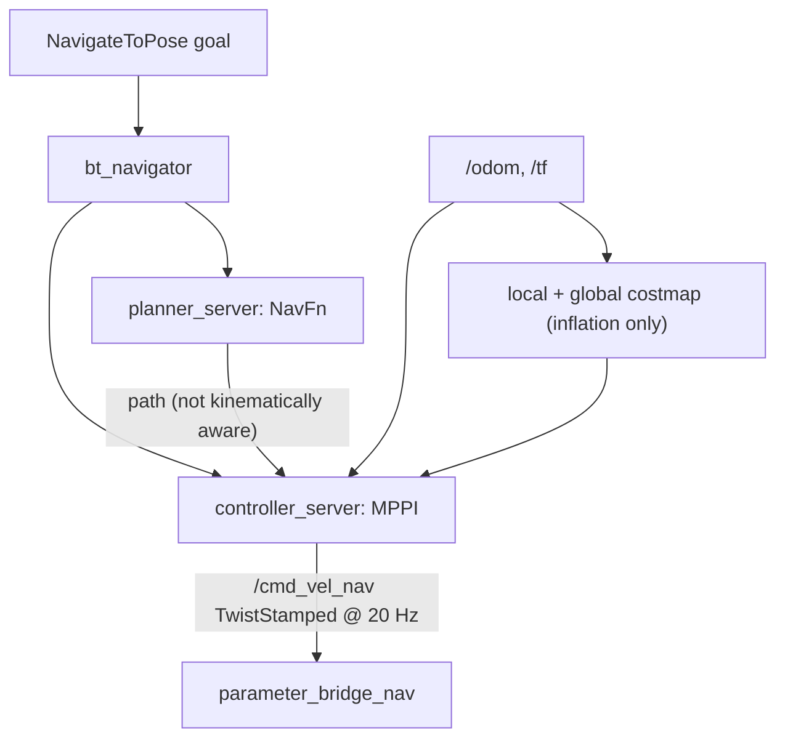
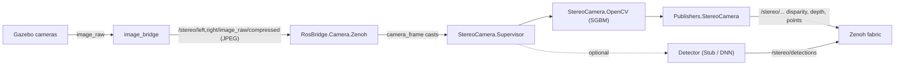
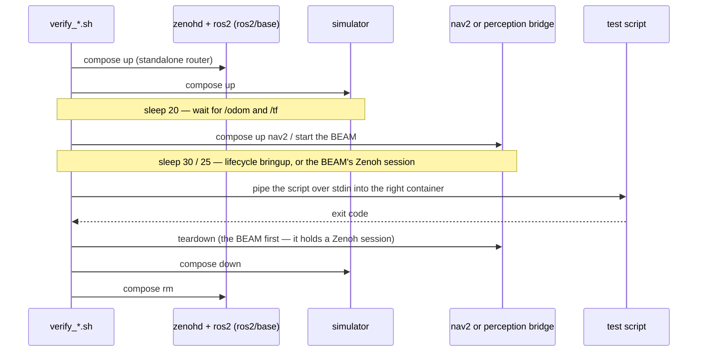

# ROS 2 and the simulator — how the pieces connect

A map, not a manual. [`ros2/simulation/README.md`](../ros2/simulation/README.md)
tells you how to *run* the simulator; this tells you what is actually
running, who owns time, and which command path is real. Read this
first, then that.

**The one thing to know before anything else.** In simulation today,
the gamepad and Nav2 drive Gazebo's physics **directly**. The Elixir
bridge, the CAN bus and the VMS — the whole vehicle-side command path —
are **not in that loop**. Only the *perception* half of the Elixir
bridge runs against the simulator. If you go looking for a CAN frame
while the simulated car is driving, you will not find one, and nothing
is broken. Section 5 shows both loops and where they will eventually
meet.

## Contents

1. [The fabric: one Zenoh router, three stacks](#1-the-fabric-one-zenoh-router-three-stacks)
2. [What the simulator starts, and in what order](#2-what-the-simulator-starts-and-in-what-order)
3. [Topics: who publishes what](#3-topics-who-publishes-what)
4. [Time](#4-time)
5. [Commands: three paths and a gap](#5-commands-three-paths-and-a-gap)
6. [Nav2, as configured here](#6-nav2-as-configured-here)
7. [Perception against the simulator](#7-perception-against-the-simulator)
8. [The three verifiers](#8-the-three-verifiers)
9. [Reading map](#9-reading-map)

## 1. The fabric: one Zenoh router, three stacks

Everything ROS-shaped in this project speaks **Zenoh**, not DDS. ROS 2
nodes use `rmw_zenoh_cpp`; the Elixir bridge speaks the `rmw_zenoh`
wire format natively through `zenohex` and links nothing from ROS.
Every participant is a *client* of one router (`zenohd`), so there is
no multicast discovery to configure and a simulated vehicle appears
on the same fabric as a real one.



The vehicle is the router so the fabric survives the laptop leaving.
With no vehicle on the LAN, `ros2/base` carries a `standalone` copy of
`zenohd` behind a compose profile — that is what every simulator
session and every `verify-*` task uses.

Three consequences worth knowing:

- **A topic is a key expression.** `rmw_zenoh` maps `/cmd_vel` to
  `0/cmd_vel/geometry_msgs::msg::dds_::Twist_/RIHS01_<hash>`. The
  Elixir bridge subscribes with a `/**` wildcard after the topic and
  matches by prefix, which is why it can subscribe by *topic* without
  knowing the type hash — and also why subscribing with the wrong
  message module fails silently rather than loudly (section 5).
- **Payloads are CDR** with a four-byte encapsulation header
  (`00 01 00 00`) and a 33-byte attachment carrying sequence number,
  source timestamp and publisher GID. `rmw_zenoh` subscribers drop
  samples without a well-formed attachment.
- **Discovery is a liveliness token**, not data. A publisher is
  invisible to `ros2 topic list` and Foxglove until it declares one on
  `@ros2_lv/...`, even while its samples flow correctly.

[`bridges/ros_bridge/README.md`](../bridges/ros_bridge/README.md) has
the wire format in full.

## 2. What the simulator starts, and in what order

`ros2/simulation/launch/sim.launch.py` brings up one vehicle in one
world. The order is load-bearing, and the launch file's own docstring
says why for each step.



Some details that read like bugs until you know them:

- `gz sim -s` is **server-only**. The GUI is a separate compose
  service (`--profile gui`) because in a headless container Qt calls
  `qFatal` and takes the physics down with it.
- `-r` **runs** the world. Without it the simulation loads paused and
  the car is immobile in a way that looks exactly like a broken drive
  plugin.
- **Two** `parameter_bridge` nodes, because Nav2 publishes
  `TwistStamped` and teleop publishes `Twist`: one topic cannot carry
  both types and one bridge cannot map two ROS topics onto one Gazebo
  topic. Section 5.
- Cameras go through `image_bridge`, not `parameter_bridge`, for
  bandwidth. Section 7.
- `use_sim_time: true` on every node. Section 4.

The model itself lives with its vehicle, in
`vehicles/ovcs_mini/description/`, and is *mounted* into the container
rather than baked in. A second vehicle is a second `description/`
directory plus one line in `docker-compose.yml`.

## 3. Topics: who publishes what

The boundary between Gazebo's transport and ROS is exactly the list in
`sim.launch.py`. Nothing crosses it unless it is named there.

| Topic | Type | Direction | Publisher | Consumer |
|---|---|---|---|---|
| `/clock` | `rosgraph_msgs/Clock` | gz → ros | Gazebo | every node, `RosBridge.Clock` |
| `/odom` | `nav_msgs/Odometry` | gz → ros | `AckermannSteering` plugin | Nav2, `drive_test.py` |
| `/tf` | `tf2_msgs/TFMessage` | gz → ros | `AckermannSteering` (`odom → base_link`) | Nav2, Foxglove |
| `/tf_static` | `tf2_msgs/TFMessage` | — | `robot_state_publisher` (the URDF's fixed joints, `chassis → stereo_left_link → stereo_left_optical`) **and** `RosBridge.Publishers.StaticTransform` (`base_link → stereo_left`) | Nav2, Foxglove |
| `/joint_states` | `sensor_msgs/JointState` | gz → ros | Gazebo | `drive_test.py` |
| `/stereo/{left,right}/image_raw/compressed` | `sensor_msgs/CompressedImage` | gz → ros | `image_bridge` | `RosBridge.Camera.Zenoh` |
| `/stereo/{left,right}/camera_info` | `sensor_msgs/CameraInfo` | gz → ros | Gazebo | perception bridge |
| `/cmd_vel` | `geometry_msgs/Twist` | ros → gz | `teleop_twist_joy`, `drive_test.py` | `AckermannSteering` |
| `/cmd_vel_nav` | `geometry_msgs/TwistStamped` | ros → gz | Nav2 `controller_server` | `AckermannSteering` |
| `/stereo/...` disparity, depth, points | `stereo_msgs`, `sensor_msgs` | — | perception bridge | Foxglove, `perception_test.py` |
| `/stereo/detections`, `.../markers` | `vision_msgs`, `visualization_msgs` | — | perception bridge | Foxglove, `perception_test.py` |
| `/ovcs_heartbeat` | `std_msgs/String` | — | every Elixir bridge | you, to see the BEAM is alive |

Two things in that table deserve a closer look.

**Two transform buffers, three publishers.** Gazebo publishes
`odom → base_link` on `/tf`, which is *time-indexed*: `tf2` stores each
sample against its stamp and interpolates between them. `/tf_static` is
*timeless* — a lookup at any stamp succeeds — and two things publish on
it: `robot_state_publisher` with the URDF's fixed joints, and the Elixir
bridge with `base_link → stereo_left`, the frame its own image headers
name. They do not collide, because the URDF's camera frames are
`stereo_left_link` and `stereo_left_optical`, not `stereo_left`; but be
aware that the simulated camera and the bridge describe the same
physical sensor under different frame names.

The bridge's static transform used to go on `/tf` at 1 Hz, which left a
window up to a second wide in which a point cloud stamped after the
newest transform could not be transformed at all — Nav2 dropped every
one, for the whole run. Moving it to `/tf_static` was the fix.

**Both `cmd_vel` topics land on the same Gazebo topic.** The
`AckermannSteering` plugin listens on `/model/<vehicle>/cmd_vel` and
has no verified tag for renaming it; the two bridges remap the ROS
side. Nothing arbitrates between them, so run teleop *or* Nav2. The
vehicle is different: there `Managers.ControlLevel` decides who has
authority, radio or ROS, and which ROS commander drives (section 5).

## 4. Time

This is the part of the integration that took longest to get right,
and the part most likely to bite a newcomer, because every failure it
causes looks like something else.

### Gazebo owns the clock

`use_sim_time: true` on every ROS node means "stamp with `/clock`, not
the wall". Gazebo starts its clock at zero and advances it with
physics, so a wall-clock stamp — 1.79e9 seconds — sits most of two
decades away from everything else on the graph. Any consumer that
compares stamps across topics drops the message, usually with a
`tf2` error about extrapolation, and the failure reads as a transform
problem rather than a clock one.

The ROS nodes get this for free from the parameter. The **Elixir
bridge does not**: it is not a ROS node, and its drivers stamp frames
with Erlang monotonic time. Something has to convert, and where that
conversion lives is the design.

### The bridge tracks an offset, not the clock



Every `/clock` sample gives a simulator time and, read alongside it, a
local monotonic time; the difference is the offset, and any monotonic
capture time projects through it. Drivers never see simulator time.
`Frame.capture_ns` means Erlang monotonic time everywhere in the
bridge, and `Timing` stays the one place that converts — the
conversion merely targets a different clock. Absent a `/clock`, the
offset is `nil` and `Timing` keeps its wall-clock behaviour, so the
vehicle path is untouched.

Reads are lock-free (`:atomics`, reference in `:persistent_term` set
once) because `Timing` runs on every published message and `/clock`
arrives at physics rate.

### Two monotonic clocks, not one

A trap that predates the simulator: Erlang's monotonic time is not the
kernel's `CLOCK_MONOTONIC`. The VM picks its own zero, so the two
differ by a large fixed offset — about 5.8e17 ns, eighteen years.
libcamera's `SensorTimestamp` is kernel-monotonic. A timestamp from one
clock projected with the other's offset lands two decades off, and
`builtin_interfaces/Time.sec` is an `int32`, so it silently wraps
negative. `Timing.from_kernel_monotonic/1` exists so that conversion
happens once, at the driver boundary.

### Why `Clock.init/1` blocks

`RosBridge.Clock` waits for the first `/clock` sample **before
returning**, holding up the rest of the supervision tree. That is
deliberate.

`tf2` prunes its buffer relative to its **newest** entry. One
transform stamped at 1.79e9 — a single wall-clock `/tf_static` message
published before the offset was known — discards every simulator-time
entry that follows and never ages out, because it is decades in the
future. Every point cloud afterwards is rejected with

```
the timestamp on the message is earlier than all the data in the transform cache
```

and the costmaps ignore stereo for the whole run. Measured: the
static-transform publisher won its race against the first `/clock`
sample by **zero milliseconds**. Blocking in `init/1`, and listing
`:simulator_clock` *first* among a vehicle's simulation components, is
what makes that race unwinnable.

### Giving up is permanent, on purpose

If no `/clock` arrives within the deadline (60 s, `:acquire_timeout_ms`),
the bridge unsubscribes and continues on wall clock for the rest of the
run. Switching to simulator time *later* sounds kinder and is worse:
by then wall-clock stamps are already in `tf2`'s buffer and one of
them has poisoned it. A run that starts on wall clock finishes on
wall clock. The deadline is generous because `docker compose up -d`
returns long before Gazebo has loaded a world, spawned the robot and
started the bridge that carries `/clock` at all.

## 5. Commands: three paths and a gap

There are three ways a velocity command can reach a drivetrain in this
project. Two of them exist in the simulator today. The third is the
vehicle's, and the simulator does not exercise it.





The simulator loop bypasses the bottom diagram entirely: Nav2's
`TwistStamped` goes straight into Gazebo's plugin, which solves the
Ackermann kinematics itself. That is why a simulated run proves Nav2
can *plan and command* for a car, and proves nothing about the VMS
converting those commands. Closing that gap — a Gazebo model driven by
the VMS through a virtual CAN bus — is the obvious next step and is
not built.

### The joystick path (0x2B0, 0x2B1)

`RosBridge.Consumers.Joy` subscribes to `/joy` and writes two frames:
`0x2B0` carries `control_level` (`joy | auto`) and `direction`; `0x2B1`
carries `throttle` and `steering` as signed 32-bit integers scaled from
the gamepad's `[-1, 1]` axes. The VMS's `OVCS.ROSControl.*` components
read them as normalised actuator requests. This is *what a joystick
means*: positions, not physics.

Two defensive details in the consumer are there because each bit
once: an axis outside `[-1, 1]` overflowed a 32-bit field and flipped
sign (full left arriving as a tenth of right), and a `Joy` with fewer
axes than expected crashed the drive path on every frame. Values are
clamped and a missing axis reads as centre.

### The velocity path (0x3A0)

`RosBridge.Consumers.Velocity` subscribes to a velocity topic and
writes `0x3A0`: `linear` (m/s) and `angular` (rad/s) as signed 24-bit
integers with `scale: 0.001, precision: 3`. This is *what a planner
means*: a physical quantity, with the kinematics solved **once, in the
VMS**, against that vehicle's own `geometry/0`:

```
δ = atan(wheelbase · ω / v)      clamped to steering_limit
ω is first clamped to |v| / (wheelbase / tan(steering_limit))
```

The clamp comes *before* the `atan`, so a yaw rate the steering cannot
achieve collapses to full lock rather than being an error branch.
Forward and reverse are the sign of `linear`; there is no direction
enum because the sign is already in the number.

The bridge only unwraps a ROS message and emits a CAN frame. It never
learns a wheelbase. Any commander — Nav2, a remote operator, a test
rig — speaks the same frame and gets correct kinematics for whatever
vehicle it is driving.

### Two switches, two questions

`Managers.ControlLevel` arbitrates between commanders, and it reads
two independent switches on the RC transmitter because *authority* and
*autonomy* are different questions:

| Channel | Component | Values | Answers |
|---|---|---|---|
| 3 | `RadioControl.RequestedControlLevel` | `:manual / :radio / :ros` | who has authority |
| 5 | `RadioControl.RequestedRosCommander` | `:teleop / :autonomous` | which ROS node, when ROS does |

`:ros` means "commands come from the ROS bridge". It does not mean the
car is driving itself — a human on a gamepad and a planner reach the
VMS over identical topics and frames. `:ros` is reachable only from
`:radio`, both switches only *request*, and arming `:autonomous` needs
a standstill while handing back to `:teleop` is immediate. The full
state machine and the bench recipe are in
[`vehicle_parameterisation.md`](./vehicle_parameterisation.md#control-levels-who-commands-and-which-ros-node).

### Two things that fail silently, in both directions

- **The wrong message type decodes as nonsense.** `Twist.parse/1`
  accepts any body of 48 bytes or more, so a 72-byte `TwistStamped`
  body decodes as six float64s read out of the header — denormals
  near 1.0e-273 — and the vehicle ignores every command while every
  watchdog reports a healthy stream. The bridge warns about surplus
  bytes after a successful parse, which is what catches this. The simulator side has the
  mirror-image failure: a `Twist` bridge fed `TwistStamped` simply
  never fires, and a healthy-looking Nav2 moves nothing.
- **A quiet input leaves the last command on the bus.** `Cantastic.Emitter`
  retransmits on a timer, so a commander that stops publishing leaves
  its last value applied for ever from the VMS's point of view. The
  VMS watches the *frame* (`Cantastic.ReceivedFrameWatcher`) and zeroes
  on loss; each consumer also watches its own *input*
  (`RosBridge.InputWatchdog`) and zeroes what it emits. Two
  hops, because they cover different failures — the bridge dying, and
  the input dying while the bridge lives.

## 6. Nav2, as configured here

Nav2 1.5.1, in its own image behind `--profile nav2`. Four lifecycle
servers and a manager, brought up in dependency order —
`controller_server`, `planner_server`, `behavior_server`,
`bt_navigator`. Not `nav2_bringup`, which is absent from the Lyrical
archive and would pull in map_server and AMCL.



What is deliberately unusual:

- **No map, no AMCL.** Every frame is `odom` and both costmaps roll
  with the vehicle. Enough to prove the velocity path drives an
  Ackermann vehicle without taking on the SLAM question, and it avoids
  a fake static `map → odom`, which looks like localisation and is not.
- **Costmaps are inflation-only on `main`.** There is no obstacle
  source: the car does not yet avoid what stereo sees. A voxel layer
  fed by the stereo point cloud exists as parked, unproven work.
- **`AckermannConstraints`.** MPPI's `motion_model` names a plugin
  *instance*; the class `mppi::AckermannMotionModel` comes from
  `<instance>.plugin`. It clamps yaw rate to `|vx| / min_turning_r`
  inside the sampler, so infeasible arcs are never considered.
  `min_turning_r` is `0.324 / tan(0.52) = 0.566 m`, rounded up to 0.6.
- **`TwistStamped` on `/cmd_vel_nav`.** `nav2_util::TwistPublisher`
  defaults `enable_stamped_cmd_vel` to true — the header comment still
  says otherwise; the code wins.
- **`Spin` is removed from both behaviour trees.** A car produces no
  motion from a spin, so it ran its full duration and burned a
  recovery slot. The spin *server* stays loaded because `bt_navigator`
  resolves every action at activation.
- **NavFn, not Smac.** No `nav2_smac_planner` in the archive, so the
  global plan is a grid search that knows nothing about turning radius.
  MPPI has to carry the corners the car cannot cut.

### Arriving proves almost nothing

Gazebo's `AckermannSteering` quietly ignores commands it cannot
execute. Measured: with `mppi::DiffDriveMotionModel` substituted in,
the vehicle reached the tight goal *better* than the correct
configuration (0.30 m against 0.53 m) while commanding **3.68×** the
kinematic yaw-rate limit. So `nav2_test.py` asserts on what was
*commanded*, and uses two goals because no single goal can test both
arrival and the limits.

## 7. Perception against the simulator

The whole stereo stack — SGBM, rectification, publishers, detector —
runs **unchanged** against Gazebo. One module differs.



`RosBridge.Camera.Zenoh` subscribes to a `CompressedImage` topic and
emits the same `{:camera_frame, %Frame{}}` casts a physical driver
does. Swapping `driver: RosBridge.Camera.LibCamera` for it is the
entire difference between the car and the simulated car. This is what
`OVCS_SIM=1` selects, in `OvcsMini.perception_sim_config/0`.

Things that are not incidental:

- **Compressed, not raw.** A 480×270 rgb8 frame is 389 KB; at 30 Hz,
  11.6 MB/s. Measured over Zenoh, a subscriber that cannot drain that
  receives **one frame every fifteen seconds** — the transport drops
  what the link will not carry and it looks like a dead topic. JPEG is
  about 6.5 KB a frame. Compression belongs upstream of the fabric,
  which is also what the real vehicle does.
- **The simulator has its own calibration.** Gazebo renders an ideal
  pinhole. Feeding it the vehicle's distortion coefficients and
  rectification rotations warped the views apart: coverage sat at
  5.4 % until `vehicles/ovcs_mini/priv/calibration/sim/` existed with
  D = 0 and R = I. Same scene, 61.2 %.
- **`:simulator_clock` is listed first**, and only here. Section 4.
- **One topic name, two roles.** `Publishers.StereoCamera` republishes
  every captured frame on `<topic_prefix>/<side>/image_raw/compressed`,
  and the prefix is `stereo` in every configuration — so against the
  simulator the bridge publishes onto the same name it is consuming
  from `image_bridge`. Whether a Zenoh session hears its own
  publications back through its subscription is not something this
  document has verified; the measured 30 Hz suggests it does not, but
  if the stereo rate ever looks doubled, this is where to look first.
- **`workshop.sdf`, not `empty.sdf`, for anything involving depth.**
  SGBM correlates texture; a flat plane under a blank sky yields no
  disparity at all.

Running it by hand takes two environment variables that fail
misleadingly if wrong (`BRIDGE_FIRMWARE_ID=ros_perception`, and
starting from `bridges/firmware` rather than `bridges/ros_bridge`);
the simulation README has the exact invocation, and
`verify-perception` exists so you rarely need it.

## 8. The three verifiers

Each is one command, brings the whole stack up, asserts, and tears it
down. Each exists because it caught something that looked fine on
screen.



| task | script | what it proves | what `/odom` alone could not |
|---|---|---|---|
| `mise run verify-drivetrain` | `drive_test.py` | wheel radius, wheelbase, steering geometry | a wrong wheel radius: it cancels inside `AckermannSteering`, so `/odom` reports 1.000 m/s while the car crawls at 0.548. The check reads `/joint_states`. |
| `mise run verify-nav2` | `nav2_test.py` | Nav2 arrives at an easy goal **and** commands within the Ackermann limits at a tight one | arrival: an unconstrained controller arrives *better* while commanding 3.68× the limit |
| `mise run verify-perception` | `perception_test.py` | depth median, p75 and p95 match the world's box positions to a centimetre; fused detection depth | throughput: geometry is machine-independent and checked tightly; rates are checked against a floor |

The hard `sleep 20` / `sleep 30` / `sleep 25` are a known fragility —
they are what "wait for the stack to settle" currently means, and a
slower machine can fail a verifier without anything being wrong.
`KEEP_UP=1` leaves the stack running to poke at.

`verify-perception` is the one that needs more than Docker: the `mise`
toolchain and a `vcan0`, because it runs the real Elixir bridge and
Cantastic will not start without a CAN network. It checks for `vcan0`
first and tells you the command to create it.

## 9. Reading map

Where to go next, by what you want to understand.

| I want to understand… | Read | Then |
|---|---|---|
| how to run any of this | [`ros2/simulation/README.md`](../ros2/simulation/README.md) | `ros2/simulation/docker-compose.yml` |
| the launch order and the bridge topic list | `ros2/simulation/launch/sim.launch.py` (its docstrings are the design notes) | `launch/nav2.launch.py`, `launch/teleop.launch.py` |
| the rmw_zenoh wire format | [`bridges/ros_bridge/README.md`](../bridges/ros_bridge/README.md) | `bridges/ros_bridge/lib/ros2/rmw_zenoh.ex`, `zenoh_client.ex` |
| time | `bridges/ros_bridge/lib/ros_bridge/clock.ex` | `timing.ex`, `publishers/static_transform.ex` |
| what a vehicle's bridge runs | `vehicles/ovcs_mini/lib/ovcs_mini.ex` (`ros_bridge_config/2`) | `bridges/ros_bridge/lib/ros_bridge/components.ex` |
| the joystick command path | `bridges/ros_bridge/lib/ros_bridge/consumers/joy.ex` | `libraries/ovcs_can/priv/can/components/ovcs/0x2B0_*.yml`, `0x2B1_*.yml` |
| the velocity command path | `bridges/ros_bridge/lib/ros_bridge/consumers/velocity.ex` | `0x3A0_ros2_control.yml`, `vms/core/lib/vms_core/components/ovcs/ros2_control/velocity.ex` |
| who commands the vehicle | [`vehicle_parameterisation.md`](./vehicle_parameterisation.md#control-levels-who-commands-and-which-ros-node) | `vms/core/lib/vms_core/managers/control_level.ex` |
| Nav2's configuration and why | `ros2/simulation/config/nav2.yaml` (heavily commented) | `config/nav2_ackermann_bt.xml`, `scripts/nav2_test.py` |
| the perception pipeline | [`ros_perception_detection.md`](./ros_perception_detection.md) | `bridges/ros_bridge/lib/ros_bridge/camera/zenoh.ex`, `stereo_camera/supervisor.ex` |
| the vehicle's ROS computer | [`ros_compute_node.md`](./ros_compute_node.md) | `ros2/vehicule/`, `ros2/README.md` |
| the model's geometry | `vehicles/ovcs_mini/description/ovcs_mini.urdf.xacro` | `gazebo_ackermann.xacro`, `OvcsMini.geometry/0` |
